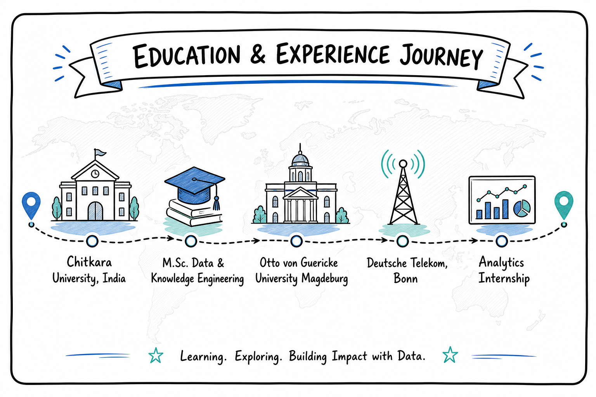
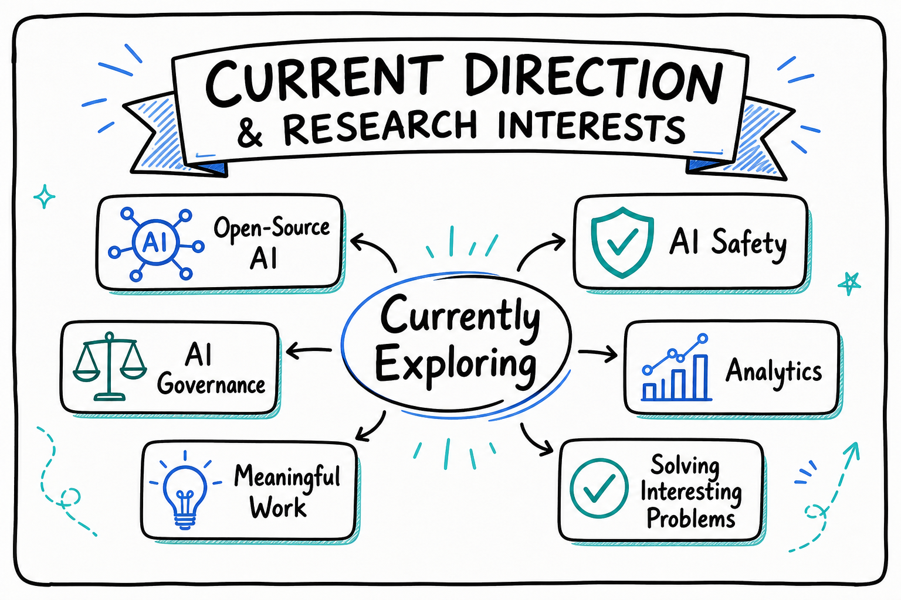

  

---

  <strong>Data & AI Practitioner | MSc Data and Knowledge Engineering</strong>

  
  &nbsp;&nbsp;
  
  &nbsp;&nbsp;
  
  &nbsp;&nbsp;
  
  &nbsp;&nbsp;
  

---

### About Me

I work at the intersection of **data analysis**, **business reporting**, and **applied AI**.

My focus is simple: _turn messy information into clear decisions_ and build practical AI-powered workflows that create real value.

- **Based in:** Leipzig, Germany
- **Background:** M.Sc. Data and Knowledge Engineering, Otto von Guericke University Magdeburg
- **Core work:** analytics workflows, reporting, ETL pipelines, and LLM-powered applications
- **Tools:** Python, SQL
- **Motivation:** meaningful work, interesting problems, responsible use of AI, and analytical curiosity about what is actually happening in the numbers, from user behavior to real-world impact

  <strong><em>AI assistants I use:</em></strong>
  
  <strong>Claude Code</strong>
  &nbsp;
  
  <strong>Codex</strong>

---

  

